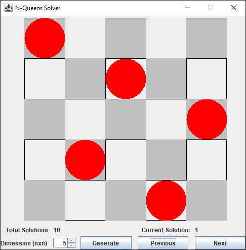

## N-Queens Visualizer
A simple visualizer for the N-Queens problem written in Java and Swing.

### Features
- Visualize placing N-Queens on a chess board with a dimension from 1x1 to 10x10.
- Visualize all possible solutions for a given dimension (if any).

### Things to do
- Add a way to visualize the backtracking algorithm in action.
